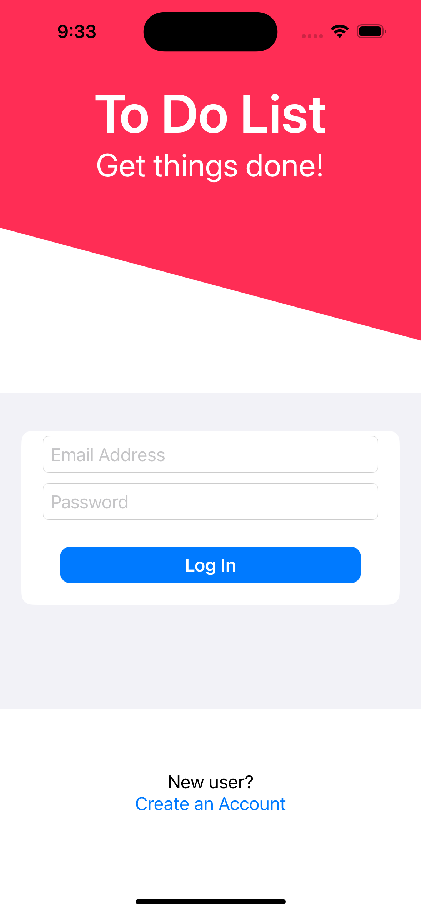
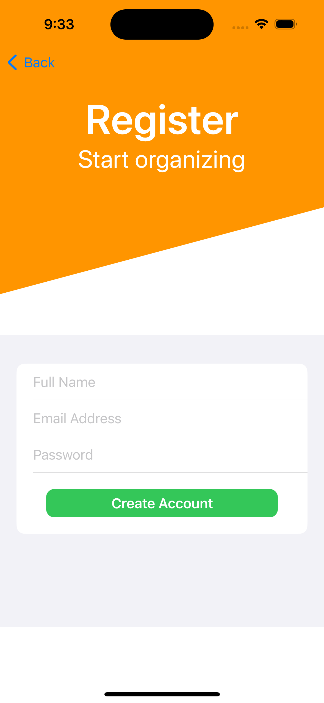
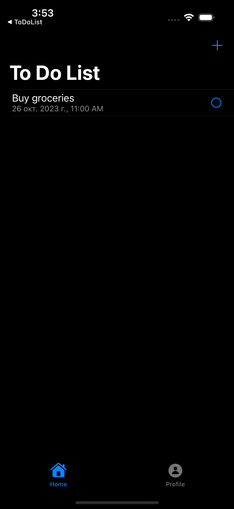
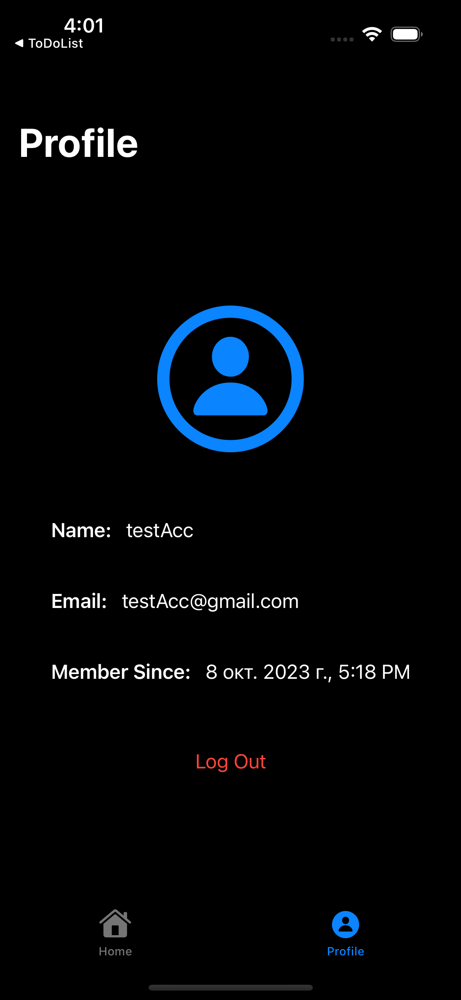
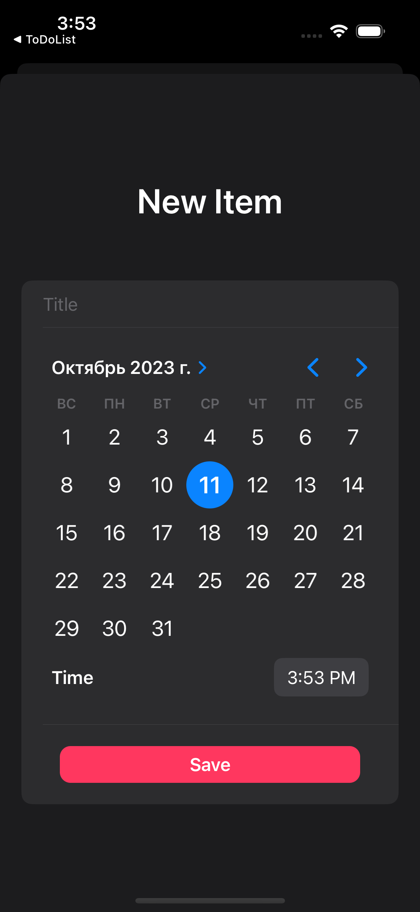

# SwiftUI-projects

This repository contains a collection of projects built using SwiftUI. Each project showcases different features and functionalities implemented using SwiftUI.

## Projects

### 1. ToDoList

**ToDoList** is a task management application that allows users to efficiently manage their daily tasks. 

- **User Authentication**: Users can easily register and log in to the app. Authentication is securely handled using Firebase Auth.
  
- **Task Management**: 
  - **Add Tasks**: Users can add tasks to their list, specifying the title, date, and exact time for each task.
  - **Delete Tasks**: Any task can be removed from the list with a simple action.
  - **Task Completion**: Tasks can be marked as completed once they are done.
  
- **Backend**: The backend of the app is powered by Firebase. All data is stored and fetched in real-time from Firebase Firestore.

  
  
   
  
  

